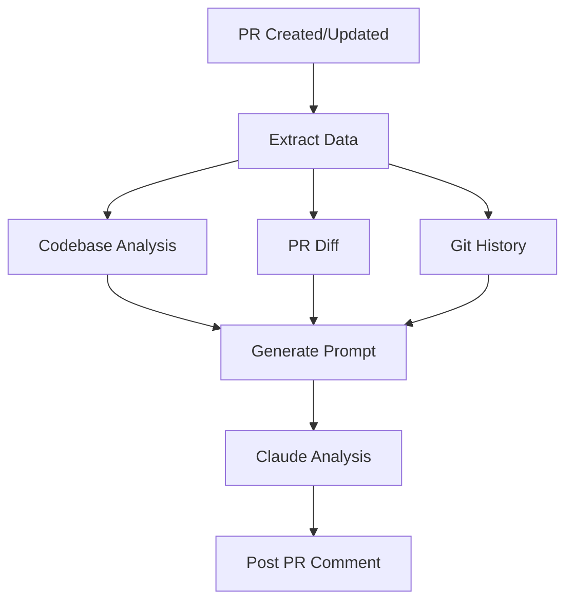
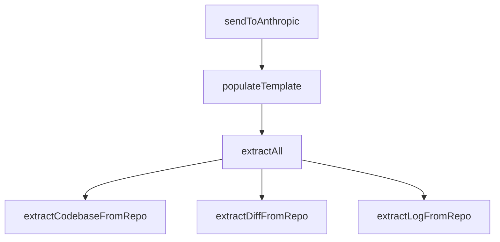

# Revu - AI-Powered Code Review Assistant

Revu is a GitHub App that leverages Anthropic's Claude AI to provide intelligent, context-aware code reviews for pull requests. By analyzing the entire codebase, changes, and commit history, Revu offers comprehensive feedback that goes beyond simple style checks.

## Features

- **Contextual Analysis**: Understands code changes in the context of the entire codebase
- **Intelligent Feedback**: Provides detailed explanations and suggestions for improvements
- **Git-Aware**: Considers commit history and branch differences
- **GitHub Integration**: Seamlessly integrates with GitHub's PR workflow
- **Customizable**: Configurable through environment variables, templates, and coding guidelines
- **Coding Guidelines**: Enforce custom coding standards through configuration

## How It Works



1. **Trigger**: When a PR is opened or updated
2. **Data Collection**:
   - Extracts full codebase for context
   - Generates diff to focus on changes
   - Retrieves git history for background
3. **Analysis**:
   - Combines data into a structured prompt
   - Sends to Claude for intelligent analysis
4. **Feedback**: Posts detailed review comments on the PR

## CLI Usage for Testing

For testing purposes, you can review closed PRs without waiting for PR events using the CLI:

```bash
# Install dependencies
yarn install

# Review a PR by URL (prints analysis to console only)
yarn review-pr https://github.com/owner/repo/pull/123

# Specify a different review strategy
yarn review-pr https://github.com/owner/repo/pull/123 --strategy line-comments

# Submit comments to GitHub after analysis
yarn review-pr https://github.com/owner/repo/pull/123 --submit

# Specify a different review strategy
yarn review-pr https://github.com/owner/repo/pull/123 --strategy line-comments
```

### Authentication for Private Repositories

To review private repositories, you need to set up GitHub App (Revu) authentication:

1. Set the following environment variables:
   - `APP_ID`: Your GitHub App ID
   - `PRIVATE_KEY`: Revu's private key (including BEGIN/END markers)

2. Make sure your Revu is installed on the repositories you want to review

By default, the CLI will output the analysis results to the console only, making it easy to test and debug the review process. When the `--submit` flag is provided, it will also post comments to GitHub using the appropriate comment handler based on the strategy.

## Setup and Installation

### Prerequisites and Installation

```bash
# Ensure correct Node.js version
nvm use v23.7.0

# Install dependencies
yarn install

# Install development tools
npm install -g smee-client  # For local webhook testing
```

Requirements:

- Node.js v23.7.0 (managed via nvm)
- GitHub account with admin access
- Anthropic API key

### GitHub App Configuration

1. Create a new GitHub App at `Settings > Developer settings > GitHub Apps`
2. Configure the app:

   ```yaml
   Name: Revu (or your preferred name)
   Webhook URL: Your server URL or smee.io proxy
   Permissions:
     - Pull requests: Read & write
     - Contents: Read
   Events: Pull request
   ```

3. Generate and save:
   - Private key
   - App ID
   - Webhook secret

### Environment Configuration

| Variable            | Type   | Description                                                                |
| ------------------- | ------ | -------------------------------------------------------------------------- |
| `ANTHROPIC_API_KEY` | string | Your Anthropic API key for accessing Claude API                            |
| `APP_ID`            | number | GitHub App ID obtained after registering the app                           |
| `PRIVATE_KEY`       | string | RSA private key generated for the GitHub App (including BEGIN/END markers) |
| `WEBHOOK_SECRET`    | string | Secret string used to verify GitHub webhook payloads                       |
| `WEBHOOK_PROXY_URL` | string | (Optional) Smee.io URL for local development webhook forwarding            |
| `REPOSITORY_FOLDER` | string | Absolute path where repositories will be cloned                            |

## Running the App

### Local Development

```bash
# Start webhook proxy (in a separate terminal)
smee -u https://smee.io/your-smee-url -t http://localhost:3000/api/github/webhooks

# Start the app
yarn dev
```

### Production Deployment

Choose one of the following methods:

#### Local Machine

```bash
yarn build
yarn start
```

#### Docker

```bash
docker build -t revu .
docker run -d \
  -p 3000:3000 \
  --env-file .env \
  -v /path/to/local/repos:/app/repos \
  revu
```

## API Reference

The API is organized in layers, with each function calling the next layer down:



### Core Functions

```typescript
// Main entry point - initiates the review process
sendToAnthropic({
  repositoryUrl: string,  // GitHub repository URL
  branch: string         // Branch to analyze
}): Promise<string>      // Returns Claude's analysis

// Combines repository data with template
populateTemplate({
  repositoryUrl: string,
  branch: string,
  templatePath?: string  // Default: templates/prompt.hbs
}): Promise<string>

// Coordinates data extraction
extractAll({
  repositoryUrl: string,
  branch: string,
  tempFolder?: string
}): Promise<{
  codebase: string,     // Processed repository content
  diff: string,         // Git diff output
  log: string          // Commit history
}>
```

### Utility Functions

```typescript
// Extract and process repository content
extractCodebaseFromRepo({
  branch: string,
  repoPath: string
}): Promise<string>

// Generate git diff against default branch
extractDiffFromRepo({
  branch: string,
  repoPath: string
}): Promise<string>

// Get formatted commit history
extractLogFromRepo({
  branch: string,
  repoPath: string
}): Promise<string>
```

### Configuration

#### Model Configuration

- Model: Claude 3 Sonnet
- Max tokens: 4096
- Temperature: 0.7
- Required env: `ANTHROPIC_API_KEY`

#### Coding Guidelines Configuration

Revu supports custom coding guidelines through a `.revu.yml` YAML configuration file in the project root:

```yaml
# .revu.yml file structure
codingGuidelines:
  - "Test coverage: Critical code requires 100% test coverage; non-critical paths require 60% coverage."
  - "Naming: Use semantically significant names for functions, classes, and parameters."
  - "Comments: Add comments only for complex code; simple code should be self-explanatory."
  - "Documentation: Public functions must have concise docstrings explaining purpose and return values."

reviewSettings:
  # Future configuration options for review behavior
```

The configuration supports:

- **Hierarchical Structure**: Organized by configuration type
- **User Overrides**: Repository-specific `.revu.yml` files can override default settings
- **Extensible Design**: Ready for future configuration options

Guidelines are automatically included in code review comments to ensure consistent standards across your projects.

## File Filtering with .revuignore

Revu supports intelligent file filtering to exclude irrelevant files from code review analysis, improving both performance and review quality. This is accomplished through `.revuignore` files that work similarly to `.gitignore` files.

### How It Works

When analyzing a repository, Revu automatically filters out files that match patterns in `.revuignore` files before sending them to the AI for review. This ensures that:

- Lock files (`yarn.lock`, `package-lock.json`) are ignored
- Generated files (`dist/`, `build/`, `*.min.js`) are skipped
- Dependencies (`node_modules/`) are excluded
- Temporary and cache files are filtered out

### Default Filtering

Revu includes a comprehensive default `.revuignore` file that covers common patterns:

```gitignore
# Lock files
*.lock
yarn.lock
package-lock.json
pnpm-lock.yaml

# Generated files
dist/
build/
*.min.js
*.map

# Dependencies
node_modules/

# OS files
.DS_Store
Thumbs.db

# IDE files
.vscode/
.idea/

# Temporary files
*.tmp
*.temp

# Build artifacts
*.o
*.so
*.dylib
*.dll
*.exe

# Logs
*.log
logs/

# Coverage reports
coverage/
*.lcov
```

### Custom Repository Filtering

To customize file filtering for a specific repository, create a `.revuignore` file in the repository root

### Priority System

Revu prioritizes a repository's own `.revuignore` file over its built-in defaults when filtering files.

### Best Practices

1. **Include generated files**: Always exclude files that are automatically generated
2. **Filter dependencies**: Exclude third-party code that doesn't need review
3. **Skip build artifacts**: Don't review compiled or minified files
4. **Exclude test fixtures**: Large test data files rarely need AI review
5. **Document patterns**: Use comments to explain complex exclusion patterns

## Troubleshooting

### Common Issues

1. **Webhook Not Receiving Events**
   - Verify smee.io proxy is running
   - Check webhook URL in GitHub App settings
   - Ensure correct port forwarding

2. **Authentication Errors**
   - Validate ANTHROPIC_API_KEY
   - Check GitHub App credentials
   - Verify private key format

3. **Repository Access Issues**
   - Confirm GitHub App installation
   - Check repository permissions
   - Verify REPOSITORY_FOLDER path exists

### Debug Mode

Enable debug logging:

```bash
DEBUG=revu:* yarn dev
```

## Contributing

1. **Development Setup**

   ```bash
   git clone https://github.com/your-username/revu.git
   cd revu
   yarn install
   ```

2. **Testing**

   ```bash
   yarn test        # Run all tests
   yarn test:watch  # Watch mode
   ```

3. **Code Style**
   - Use TypeScript
   - Follow existing patterns
   - Add JSDoc comments
   - Include tests

4. **Pull Requests**
   - Create feature branch
   - Add tests
   - Update documentation
   - Submit PR with description

## License

This project is licensed under the MIT License.

```text
MIT License

Copyright (c) 2025 Revu

Permission is hereby granted, free of charge, to any person obtaining a copy
of this software and associated documentation files (the "Software"), to deal
in the Software without restriction, including without limitation the rights
to use, copy, modify, merge, publish, distribute, sublicense, and/or sell
copies of the Software, and to permit persons to whom the Software is
furnished to do so, subject to the following conditions:

The above copyright notice and this permission notice shall be included in all
copies or substantial portions of the Software.

THE SOFTWARE IS PROVIDED "AS IS", WITHOUT WARRANTY OF ANY KIND, EXPRESS OR
IMPLIED, INCLUDING BUT NOT LIMITED TO THE WARRANTIES OF MERCHANTABILITY,
FITNESS FOR A PARTICULAR PURPOSE AND NONINFRINGEMENT. IN NO EVENT SHALL THE
AUTHORS OR COPYRIGHT HOLDERS BE LIABLE FOR ANY CLAIM, DAMAGES OR OTHER
LIABILITY, WHETHER IN AN ACTION OF CONTRACT, TORT OR OTHERWISE, ARISING FROM,
OUT OF OR IN CONNECTION WITH THE SOFTWARE OR THE USE OR OTHER DEALINGS IN THE
SOFTWARE.
```
